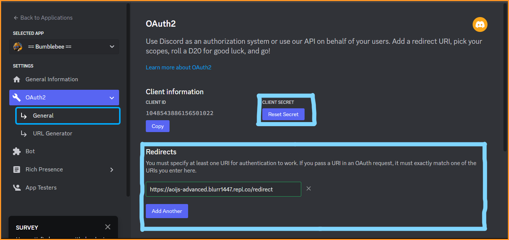

# Aoi.js Advanced V6 Template With An In-Built Panel & Dashboard!
Example preview: [link](https://aoijs-advanced.blurr1447.repl.co/)
## Introduction To Aoi.js
### [Aoi.js](https://www.npmjs.com/package/aoi.js) is a npm package that simplifies coding discord bots. 

Made By [Akarui Development](https://github.com/AkaruiDevelopment/).


#### **Aoi.js Links:** (you might need)
- [Discord Server](https://discord.gg/9nPxvZT59D)
- [NPM](https://www.npmjs.com/package/aoi.js)
- [Website / Docs](https://aoi.js.org/)
- [Github](https://github.com/AkaruiDevelopment/aoi.js)

# **USAGE**


## DO NOT use the code before reading this FULLY!!

Recomended host: N/A [Use any host you are comfortable with.].

**Language:** Javascript [Node.js]

**Required Packages:** Aoi.js (`npm i aoi.js`), Express (`npm i express`), Fs (`npm i fs`), @akarui/aoi.panel (`npm i @akarui/aoi.panel`).

**Start:** `node .` or `node index.js`.


## Setup:
###
- Go to `config.js`. 
- Fill in bot details, Panel configuration.
Note: Use `.env` to keep your bot token, panel username and password a secret.
- Run the code.
## Editing The Code:
### Adding events [callbacks]:
- Go to `config.js` -> `bot` -> `events`.
```json
"events":["onMessage", "onInteractionCreate"],
```
- Add your callbacks For more details go to [the documentation.]([https://aoi.leref.ga/v/aoi.js-v5/callbacks](https://aoi.js.org/docs/guides/events))

### Adding Status:
- Go to `/status/`.
- Add your status code in new file/replace the old status codes. For eg:
```js
module.exports=({
  text:"Hello World!",//text in the status
  type:"PLAYING",// types: PLAYING,LISTENING,COMPETING, e.t.c.
  time:"12"// time is should show the status for. (not needed unless multiple statuses are being used.)
})
```

### Adding variables:
- Go to `variables.js`.
```js
module.exports={
  dev:"Bumblebee",
  /*
  Adding Variables: to add variables just do `<variable name> : "<variable value>",`
  */
}
```
- Add `(variable name):"(variable value)",`
### Adding Commands:
- Go to `./commands/message commands/` folder.
- Create a new js file. eg: "ban.js"
- Add your code there. For eg:
```js
module.exports ={
name:"ban",//command name
aliases:["bon"],//command alias
code:`
$title[BONNED!!]
$description[banned $userTag[$mentioned[1]]]
$ban[$mentioned[1];Banned By $userTag[$authorID]]`//code
}

```
### Creating Slash Commands:
-  Read the docs [here](https://aoi.js.org/docs/guides/interactioncommands).

### Replying To The Slash Commands:
- Go to `./commands/slash commands/` folder.
- Create a new js file. eg: "hi.js"
- Add your code there. For eg:
```js
module.exports = ({
name: "hi",
type: "interaction",
prototype: "slash",
code: `$interactionReply[Hi <@$interactionData[author.id]> !;{newEmbed:{title:Hello!}{description:Hey man! Wassup?!};;;everyone;yes}]`

})

```

## Panel
### This Template also includes aoi.panel, which is a UI for aoi.js. Here is its [link](https://github.com/AkaruiDevelopment/panel)

## Dashboard
### Input your config in config.js under "dash"
```json
"dash":{
    clientId:"your bot's id",
    clientSecret:"client secret [take from discord.dev]",
    redirectUri:"https://{your website address}/redirect",
  } 
```
`clientId`=> Bot's Discord ID [type: snowflake]
`clientSecret`=> Client Secret [take from discord dev portal]
`redirect uri`=> Discord auth redirect url [also update this in discord dev portal!]


## To Do:
- [ ] Add Slash Commands Creating.
- [ ] Add aoi.music Integration.


## More Features Comming soon!
## Made By: Bumblebee aka Blurr
# It has taken me lots of time and effort to make this and a star would mean a lot to me! <3

